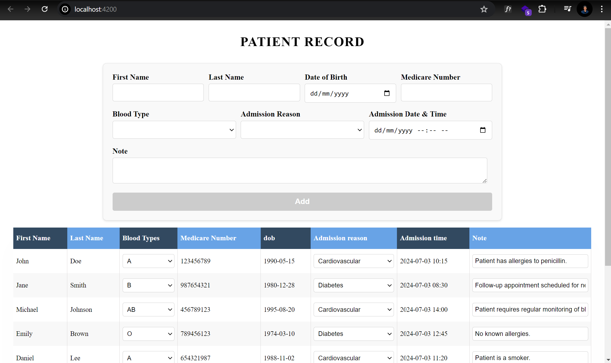

# Getting Started with Patient Record Interface

This project demonstrates a basic implementation of a dynamically rendering a table based on given data and adding datas to the list utilizing Angular.

<div align="center">

</div>

## Features

- **Dynamic Rows**: User will be able to add the patient data which will be listed in the list.
- **Interactive UI**: The user interface is dynamic and responsive, providing a smooth user experience.
- **Organized data**: Data is presented in a structured and easy-to-read table format.
- **Accessible Row on hover**: Rows change background color and font weight when hovered over to make it easier to see details of the patients.

## Running the Server at LocalHost

To run the server, follow these steps:

1. **Clone the Repo**

   ```bash
   git clone https://github.com/Arjesh1/Arjesh-Khadka-moh-test.git

   ```

2. **Install Dependencies**

   ```bash
   npm install

   ```

3. **Start the Server**

   ```bash
   npm start
   ```
